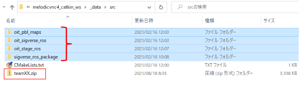

# Final competition

## Introduction

Now, for the final competition, you are going to develop a program that combines robotics and image processing, referring to the team exercise 1 in pre-learning.
In the team exercise 1, you have developed a program that simply combined Robot and image processing.
In the final competition, you will develop a more sophisticated story-based program in which robots and person interact, like dungeon exploring etc..
We hope that you will be able to program an attractive and fun robot-human interaction!

The slides submitted by each team in [Team Exercise 1 of the pre-learning](https://github.com/oit-ipbl/Integration/blob/main/team_exercise/team_exercise.md#exercise1-team-development) will be made available on Slack. For the final competition, please refer to the slides of other teams and do your best!

## Rules

1. Set 3 or more coordinates (hereinafter called `Check point`) on the Stage simulation field. Your robot should move all of the `check points` one by one.
   - The `check points`' locations are arbitrary, but your robot must pass through them by [`ROS navigation`](https://github.com/oit-ipbl/robots/blob/main/robot_control/robot_control_03.md#ros-navigation). Carefully check and test your programs to ensure that the robot can reach the `check points`.
   - If distances between `check points` are so short, [evaluation score](#evaluation-criteria) of your programs may be low.
2. A mini-game including Windows side [`image processing techniques`](https://github.com/oit-ipbl/image_processing) should be launched, when the robot reaches each `check point`. Therefore, you should implement at least 3 mini-games.

## Submissions

Each team should submit the following 6 materials by 9/3 22:00 (Thai), 24:00 (Jp).  
The submission form will be announced on SLACK.

1. Slide for the presentation of your team's program.
   - Make 7 minutes presentation slide, like [Exercise1 (team development)](https://github.com/oit-ipbl/Integration/blob/main/team_exercise/team_exercise.md#exercise1-team-development).
   - The file format should be `PPTX` or `PDF`. Editor tools are not specified.
   - You will need to use these slides to make a presentation in front of everyone at 9/4.
2. A video of gameplay.
   - The maximum time of the video is 10 minutes.
   - The video will be uploaded to YouTube with `unlisted` style, and all iPBL participants will see it for evaluation of your team's final-competition works.
   - File format should be popular video format, such as `mp4`, `wmv` and so on.
3. A poster (one-page) that introduces the content.
   - The poster will be on display with the demo movie at 9/4 on oVice.
   - The format of the poster is free. Create a poster that conveys the technical aspects and attractiveness of your program.
   - The file format should be `PDF`.
   - Since some students cannot participate in Part A, we will hold a demo session and poster exhibition in Part A and a team presentation in Part B.
4. ROS packages' source code, that is zipped the files in directories under `~/catkin_ws/src`.
   - Check [How to access files and directories in the ROS container](https://github.com/oit-ipbl/portal/blob/main/setup/dockerros.md#how-to-access-files-and-directories-in-the-ros-container) again, and access the directories of the ROS container from Windows.
   - Open `\\wsl$\docker-desktop-data\version-pack-data\community\docker\volumes\melodicvnc_catkin_ws\_data\src` from Windows file manager.
   - Make a `zip` archive of the directories. The `CMakeList.txt` is **NOT** needed. The `zip` filename is `teamXX.zip`. `XX` means your team name (`a, b, c...`).  
   
5. Zipped files of all source codes and images (in the `py21/code` folder) for Windows Side each content.
6. Operation manual of your software. The manual may include the start-up procedure of your ROS packages and Windows side programs, play manual.
   - The file format should be `PDF`. Editor tools are not specified.

## Evaluation criteria

- The final competition work will be graded by each student based on the presentation, video and demo session on the last day of this iPBL.
  - The final presentation will consist of [two parts](https://github.com/oit-ipbl/portal#closing-ceremony94). In the first part, you will give a presentation, and in the second part, you will demonstrate your program (demo session) in each team area of oVice.
- The score is composed of the following 2 aspects.

1. Technical aspects (0 to 5 points): Technical excellence in image processing and robot programming. Evaluate the quality and quantity based on the technical perspective of the product.
2. Attractiveness aspects (0 to 5 points): Attractiveness of the content. Evaluate the extent to which you found the presentations, videos, and demonstrations to be attractiveness.

